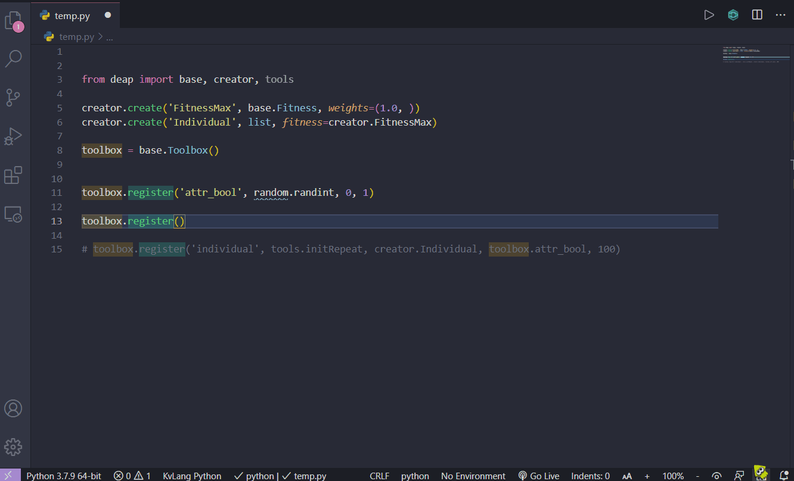
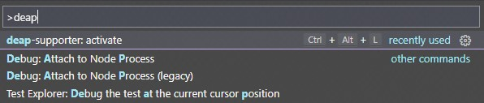
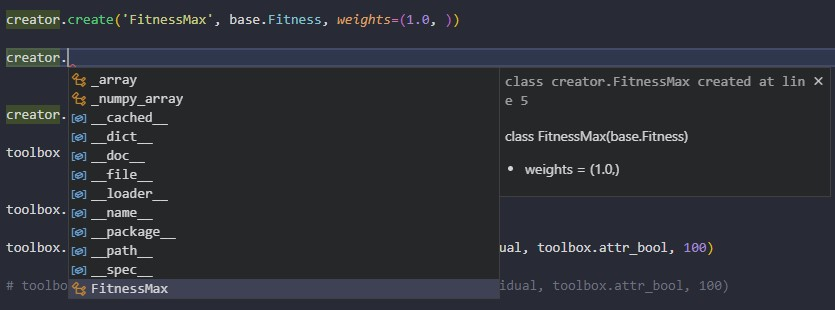
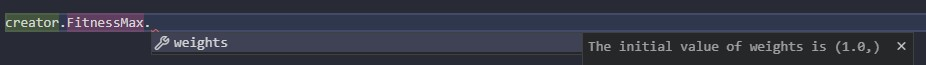
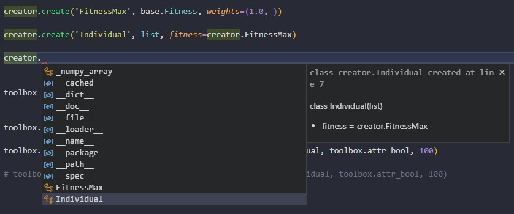
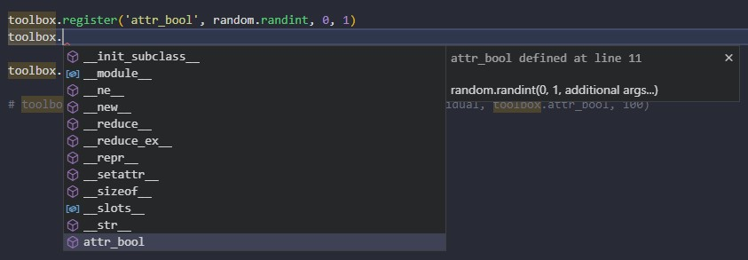

# Deap-supporter

a useful extension when you use [Deap](https://github.com/deap/deap); a framework for Evolutionary Algorithm.



## Features

This extension provides some useful functions when coding deap in python.

deap.creator.create is useful, however this function dynamically generates python class, so there is no code compliment for its class name and attributes.
Now, if you install this extension, **you are free to compliment them!!**

Deap-supporter supports compliment, detail, a brief documentation and definition jump against
- your classes generated by `deap.creator.create()`
- your aliases registered by `deap.base.ToolBox.register()`

## Usages

**First of all, load and parse your python file.**
Note that this extension activates when you execute commands.

For this, execute the command:`deap-supporter.loadDocument`.(keybinding: ctrl+alt+l)
if there are some valid statements, you can do coding comfortably.

I believe you can make sense easily by reading below example.

### example

You will write...

```python
from deap import base, creator, tools

creator.create('FitnessMax', base.Fitness, weights=(1.0, ))
```

then, execute the command:`deap-supporter.loadDocument` from command pallet.


Well, **keybinding: ctrl+alt+L** is naturally more useful.

After you execute the command, the editor suggests `FitnessMax` with a brief documentation if you type `creator.` like below.
you can see *its base class* and *its attributes*


This documentation format may be changed in future version, but absolutely holds the information of its base class and its attributes.

In addition, the editor suggests its attributes with its initial value.
This detail format may be changed in future version as well.



And now, suppose you add the code below.
```python
creator.create('Individual', list, fitness=creator.FitnessMax)
```

If you code additional `creator.create()`, you should execute `deap-supporter.loadDocument` (ctrl+alt+L).
Then editor will suggest `creator.Individual`.



Note that **your editor never suggests if you forget executing loadDocument command**.

examples above are for `creator.create()`, but `ToolBox.register()` is same.
You will write codes like below.
```python
import random
from deap import base, creator, tools

toolbox = base.Toolbox()
toolbox.register('attr_bool', random.randint, 0, 1)
```

Then execute the command for loading, mainly `deap-supporter.loadDocument` with ctrl+alt+L.
And the editor will suggest toolbox.attr_bool with its equivalent code like below .


where `additional args` means the rest of its arguments, as ToolBox.register just do partial application.

If you use another name for the instance of `deap.base.ToolBox`, you must change settings for this extension. See [Settings](#extension-settings).

### Attention

if your code is invalid like below,

```python
creator.create('Individual', list, 
```
this extension will not load this line.
The rule is that the line
- starts with `creator.create` (or you can change its value. see [Settings](#extension-settings))
- ends with `)`
- has class name as a first argument; like `creator.create('Foo', ...)` or `creator.create("Bar", ...)`

if the line does not have class name, throw Error. (will be changed in future version)

Some of examples of invalid codes are
- creator.create('Individual', list, 
  - because the line does not end ')'.
- creator.create(Hoge, fuga)
  - because it has no '' or "".

These line will not be loaded in extension if you write.
... The Python extension may warn.

## Extension Commands

### `deap-supporter.loadDocument`

*keybinding: ctrl+alt+L*

The main command of this extension.
Load current python file by following [the rule above](#attention).
Normally you use only this command.
All of classes created and alias registered that this extension has already held will be overwrote by default. So compliment reflects the current, latest file codes.
If you do not overwrite, you can change configuration corresponding. See [deap-supporter.alwaysOverwrite](#deap-supporteralwaysoverwrite)

### `deap-supporter.loadSelection`

Load from selection.
Its function is as same as the one of `deap-supporter.loadDocument` except for the target to load.

### `deap-supporter.reloadDocument`

Load current python file, but if this extension found a same class name or alias name, overwrite it.
You do not need to execute this command if `deap-supporter.alwaysOverwrite` is true(default), as its effect is same.

## Extension Settings

### `deap-supporter.alwaysOverwrite`

*default: true*

If false, the classes and aliases will not be overwrote by `deap-supporter.loadDocument` or `deap-supporter.loadSelection`.
You can overwrite them only by `deap-supporter.reloadDocument`.

### `deap-supporter.neverShowSuccessfulInformation`

*default: false*

If true, never show the message to notify its process to load has finished successfully.

### `deap-supporter.createCallWay`

*default: "creator.create"*

The coding style to call create().

If your coding style is like deap.creator.create(),
```python
import deap
deap.creator.create('Hoge', Fuga, attr=10)
```
you should set this configuration 'deap.creator.create'.

For extreme example, if your code is like below,
```python
from deap import creator as c
c.create('Foo', Bar, foobar=10)
```
you should set `deap-supporter.createCallWay` : c.create

### `deap-supporter.InstanceNameOfToolBox`

*default: "toolbox"*

The name for instance of deap.base.ToolBox.

If your coding style is like below,
```python
from deap import base

toolBox = base.ToolBox()

toolBox.register('Hoge', fuga)
```
you should set this configuration `"toolBox"`.

This extension does not depend on how to call `deap.base.ToolBox`.

## Requirements

No special requirements.
you should just use the latest version of VScode.

## Contributions

I would like to implement showing the full documentation and its signature but I don't know how to do it.
I'm waiting for your contribution.

## Known Issues

No issues now, I believe.

## Release Notes

### 1.0.0

Initial release!

